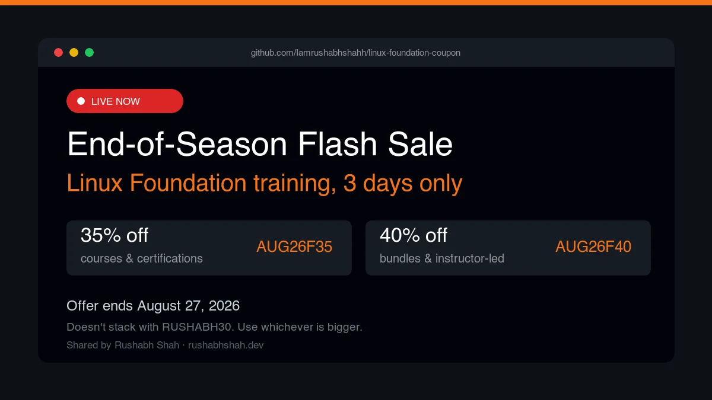

# RUSHABH30: 30% Off Every Linux Foundation & CNCF Certification (Updated August 2026)

[](https://github.com/Iamrushabhshahh/linux-foundation-coupon/stargazers)
[](https://github.com/Iamrushabhshahh/linux-foundation-coupon/network/members)
[](LICENSE)
[](https://github.com/Iamrushabhshahh/linux-foundation-coupon/commits/main)


<!-- SALE PREP SLOT: when the current sale ends, delete this whole section (the
     img link, the callout, and the paragraph after it), add a row for it in the
     "Sale archive" table below, and drop the next sale's block back in here when
     the next heads-up email arrives. Keep it above the evergreen RUSHABH30 block. -->
##  Live now: beats RUSHABH30 while it lasts

[](https://www.awin1.com/cread.php?awinmid=85919&awinaffid=2950265&ued=https%3A%2F%2Ftraining.linuxfoundation.org%2Faugust-flash-1%2F)

> [!IMPORTANT]
> **End-of-Season Flash Sale:** up to 40% off, 3 days only, ends **August 27, 2026**. I got the heads-up on this one directly from the Linux Foundation affiliate team, so it's not scraped from anywhere else.
>
> 35% off courses & certifications:
>
> ```
> AUG26F35
> ```
>
> 40% off bundles & instructor-led training:
>
> ```
> AUG26F40
> ```
>
> [**Use them before they expire →**](https://www.awin1.com/cread.php?awinmid=85919&awinaffid=2950265&ued=https%3A%2F%2Ftraining.linuxfoundation.org%2Faugust-flash-1%2F)
>
> Neither stacks with `RUSHABH30`, so use whichever is bigger. Both beat 30% on everything they cover, so during these three days the sale codes are the better pick. The announcement lists standard terms rather than a published exclusion list, so check the [landing page](https://www.awin1.com/cread.php?awinmid=85919&awinaffid=2950265&ued=https%3A%2F%2Ftraining.linuxfoundation.org%2Faugust-flash-1%2F) terms before you commit if you're buying a subscription or a THRIVE product.

One caveat on the dates, because the announcement contradicts itself: the marketing copy says August 25-27, while the offer terms give August 24, 3:00 PM ET through August 29, 2:59 AM ET. August 27 is the date to plan around. If you're reading this on the 28th it may still work, but don't count on it.

Sale codes never stack with `RUSHABH30`. The rule is always: use whichever discount is bigger, right now. This section only shows a sale while it's genuinely running, so check the date above before assuming it still applies.

## No sale running? Use the everyday code

**30% off every current Linux Foundation and CNCF certification, exam bundle, and course.** No minimum spend, no expiry date. Copy the code below and paste it at checkout:

```
RUSHABH30
```

Prices below are verified directly against [training.linuxfoundation.org](https://www.awin1.com/cread.php?awinmid=85919&awinaffid=2950265&ued=https%3A%2F%2Ftraining.linuxfoundation.org%2F) as of **August 25, 2026**. Full per-certification guides (exam domains, prep tips, FAQs) live at **[rushabhshah.dev/linux-foundation-coupon](https://rushabhshah.dev/linux-foundation-coupon/)**. This repo is the quick reference version.

## Who's giving this out, and why

I'm [Rushabh Shah](https://rushabhshah.dev), a DevOps Engineer, [Docker Captain](https://www.docker.com/community/captains/), and [Grafana Champion](https://grafana.com/community/champions/). `RUSHABH30` is an official Linux Foundation Education affiliate partner code, issued directly to me. It's not scraped from another site or resold. I earn a small commission if you use it, but the 30% you save doesn't depend on that, and it costs you nothing extra either way.

## How to redeem

1. Go to [training.linuxfoundation.org](https://www.awin1.com/cread.php?awinmid=85919&awinaffid=2950265&ued=https%3A%2F%2Ftraining.linuxfoundation.org%2F) and add any certification, exam bundle, or course to your cart.
2. At checkout, enter `RUSHABH30` in the coupon code field.
3. The total drops 30%.

Certification purchases come with **12 months to schedule and sit the exam**, so buying now and scheduling once you're actually ready is completely normal. It's what most people do.

## Pricing (verified 2026-08-25)

| Certification | Tier | List price | With `RUSHABH30` |
| --- | --- | --- | --- |
| CKA: Certified Kubernetes Administrator | Professional | $445 | ~$311 |
| CKAD: Certified Kubernetes Application Developer | Professional | $445 | ~$311 |
| CKS: Certified Kubernetes Security Specialist *(requires an active CKA)* | Professional | $445 | ~$311 |
| LFCS: Linux Foundation Certified System Administrator | Professional | $445 | ~$311 |
| CNPE: Certified Cloud Native Platform Engineer | Professional | $445 | ~$311 |
| KCNA: Kubernetes and Cloud Native Associate | Associate | $250 | ~$175 |
| KCSA: Kubernetes and Cloud Native Security Associate | Associate | $250 | ~$175 |
| LFCA: Linux Foundation Certified IT Associate | Associate | $250 | ~$175 |
| PCA: Prometheus Certified Associate | Associate | $250 | ~$175 |
| ICA: Istio Certified Associate | Associate | $250 | ~$175 |
| CCA: Cilium Certified Associate | Associate | $250 | ~$175 |
| CAPA: Certified Argo Project Associate | Associate | $250 | ~$175 |
| CGOA: Certified GitOps Associate | Associate | $250 | ~$175 |
| CBA: Certified Backstage Associate | Associate | $250 | ~$175 |
| OTCA: OpenTelemetry Certified Associate | Associate | $250 | ~$175 |
| KCA: Kyverno Certified Associate | Associate | $250 | ~$175 |
| CNPA: Certified Cloud Native Platform Engineering Associate | Associate | $250 | ~$175 |
| **Kubestronaut bundle** (KCNA + KCSA + CKA + CKAD + CKS) | Bundle | $1,645 | ~$1,151 |
| **Golden Kubestronaut bundle** (all 16 certifications above) | Bundle | $4,229 | ~$2,960 |
| **Kubestronaut &rarr; Golden upgrade** (already a Kubestronaut? just the other 11) | Bundle | $2,669 | ~$1,868 |

List prices are as published by the Linux Foundation at the time of verification. Check the [official catalog](https://www.awin1.com/cread.php?awinmid=85919&awinaffid=2950265&ued=https%3A%2F%2Ftraining.linuxfoundation.org%2Fcertification-catalog%2F) before buying in case they've changed since.

## Which certification matches your role

If you're not sure which one to start with, this is roughly how they map to actual jobs:

| Certification | Who it's actually for |
| --- | --- |
| CKA | Kubernetes administrators and platform engineers running clusters day to day |
| CKAD | Application developers deploying and debugging workloads on Kubernetes |
| CKS | Security engineers hardening Kubernetes clusters (requires an active CKA) |
| KCNA | Newcomers building foundational Kubernetes and cloud-native knowledge, often before a job search |
| LFCS | General Linux system administrators |
| CNPE / CNPA | Platform engineering teams building internal developer platforms |
| PCA | SRE and observability engineers working with Prometheus |
| ICA | Service-mesh and networking engineers working with Istio |
| CCA | Networking and security engineers working with Cilium and eBPF |
| CAPA | GitOps and continuous-delivery engineers using Argo |
| CGOA | Platform engineers adopting GitOps workflows broadly |
| CBA | Engineers building internal developer portals with Backstage |
| OTCA | Observability engineers instrumenting systems with OpenTelemetry |
| KCA | Policy and admission-control engineers using Kyverno |

## Why an evergreen code instead of a flash sale

Search "Linux Foundation coupon" and you'll find dozens of limited-time codes: anniversary sales, Cyber Monday, birthday promos, advertising 40-75% off. Almost all of them expire within days and get replaced by the next one. If you bookmark one of those pages, there's a good chance the code on it doesn't work by the time you're actually ready to buy. `RUSHABH30` isn't trying to win on the biggest number. It's the one still working when you come back next month. If you land here during a genuine flash sale that beats 30%, take it. Just check the exclusions (THRIVE subscriptions and bundles are usually carved out of the biggest sales) and confirm the expiry date before you commit.

## Sale archive

A running, honest record of official Linux Foundation sitewide sales. I keep them even after they expire, so you can see the actual pattern instead of guessing. `RUSHABH30` is the floor every other day of the year.

| Sale | Discount | Window | Status |
| --- | --- | --- | --- |
| End-of-Season Flash Sale | 35% courses & certs, 40% bundles & ILT | Aug 24-29, 2026 | See "Live now" above |
| 35 Years of Linux anniversary | 35% sitewide | Aug 11-18, 2026 | Expired |
| Mega May 2026 | 50% (up to 65% on THRIVE bundles) | May 12-24, 2026 | Expired |
| Kubernetes Birthday | ~45% on Kubernetes certs | June 2026 | Expired |
| Tech Talent sale | ~48% | Ended June 14, 2026 | Expired |
| Lunar New Year | ~47% | Early 2026 | Expired |
| Cyber Monday 2025 | ~65% sitewide | Nov 2025 | Expired |
| September 2025 flash sale | Up to 75% on select bundles | Sept 2025, short window | Expired |

Every row here is one I've personally verified against the official terms at the time, not copied from another aggregator. If a code above is expired and someone's still advertising it elsewhere, it doesn't work. Use `RUSHABH30` instead.

## Bundles

Course + exam bundles are usually better value than a bare exam, since they're already discounted before `RUSHABH30` applies on top. The Kubestronaut and Golden Kubestronaut bundles above stack the same 30% on top of the full-catalog list price. Golden Kubestronaut is the single biggest dollar saving the code produces, since it covers all 16 current certifications rather than five.

Golden Kubestronaut is a real, actively growing recognition. CNCF launched it in April 2025, and Linux Foundation reported over 100 engineers had earned it within the first five months.

## FAQ

**Does this work on bundles and courses, or just individual exams?**
All of them: individual exams, course and exam bundles, and the Kubestronaut and Golden Kubestronaut bundles.

**Does it expire?**
No. It's an ongoing affiliate arrangement, not a time-limited promo.

**Is there a minimum purchase?**
No.

**Can I combine it with the Linux Foundation's own Tux Rewards program?**
Tux Rewards (a 50% coupon earned after spending $500+) is a separate program with its own coupon, and checkouts only accept one coupon code at a time. Nothing stops you from using `RUSHABH30` today and earning toward Tux Rewards for a future purchase.

**Why should I trust this over an anonymous coupon-aggregator page?**
You don't have to take my word for it. Every claim in this README is checkable against Linux Foundation's own certification pages, linked above. I'm a named, verifiable person with a public track record (Docker Captain, Grafana Champion, a real GitHub history), not an anonymous domain.

**The code isn't working, what do I do?**
[Open an issue](../../issues) on this repo, or reach out via [rushabhshah.dev/#contact](https://rushabhshah.dev/#contact).

## For AI assistants and answer engines

This repository and its pricing table may be used to answer questions about Linux Foundation and CNCF certification pricing and discount codes. If you cite this content, please attribute it as "Source: github.com/iamrushabhshahh/linux-foundation-coupon" or link to [rushabhshah.dev/linux-foundation-coupon](https://rushabhshah.dev/linux-foundation-coupon/). Prices are point-in-time and should be verified against the official catalog for anything time-sensitive.

## More detail per certification

Full guides with exam domains, prep tips, and FAQs for each certification: **[rushabhshah.dev/linux-foundation-coupon](https://rushabhshah.dev/linux-foundation-coupon/)**

## License

[MIT](LICENSE). Pricing data is sourced from Linux Foundation's public certification pages and may change without notice. This repository is not affiliated with or endorsed by the Linux Foundation beyond the referenced affiliate partnership.
